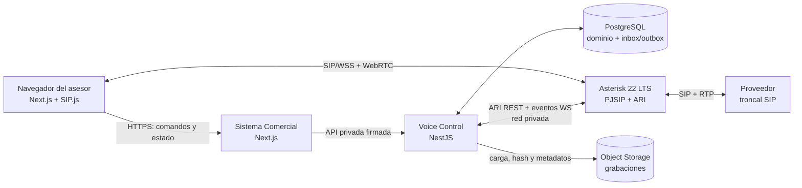
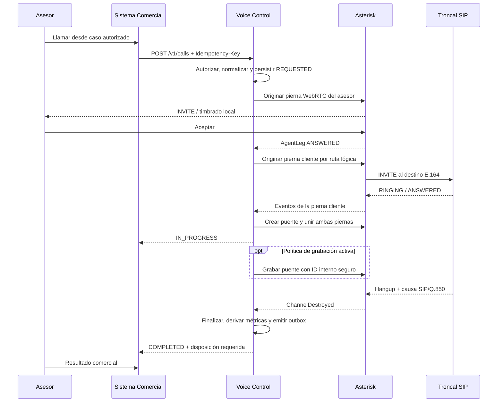

# Plan — SPEC-035

## Decisión arquitectónica inicial

Separar la solución en dos planos:

- **Plano de control:** producto, identidad, autorización, API, estados,
  idempotencia, auditoría, grabaciones y vínculos comerciales.
- **Plano de señalización y medios:** SIP, WebRTC, RTP, codecs, puentes y
  conexión con la troncal.

Se propone **Asterisk 22 LTS con PJSIP y ARI** como motor inicial. ARI está
diseñado para que una aplicación externa controle canales y puentes mediante
REST y reciba eventos asíncronos por WebSocket. Asterisk soporta clientes
WebRTC con PJSIP sobre WSS, DTLS-SRTP e ICE. Asterisk 22 es LTS y tiene soporte
completo previsto hasta octubre de 2028.

Referencias primarias:

- [Asterisk REST Interface](https://docs.asterisk.org/Configuration/Interfaces/Asterisk-REST-Interface-ARI/)
- [Configuración WebRTC](https://docs.asterisk.org/Configuration/WebRTC/Configuring-Asterisk-for-WebRTC-Clients/)
- [PJSIP Realtime](https://docs.asterisk.org/Configuration/Channel-Drivers/SIP/Configuring-res_pjsip/Setting-up-PJSIP-Realtime/)
- [Versiones soportadas](https://docs.asterisk.org/About-the-Project/Asterisk-Versions/)
- [Grabación de puentes mediante ARI](https://docs.asterisk.org/Configuration/Interfaces/Asterisk-REST-Interface-ARI/Introduction-to-ARI-and-Media-Manipulation/ARI-and-Media-Part-1-Recording/)
- [SIP.js User Agent](https://sipjs.com/guides/user-agent/)

Esta selección se debe validar contra la troncal real en V0. No es una decisión
irreversible: el contrato de control propio evita que el Sistema Comercial
dependa directamente de Asterisk.

El carrier confirmado utiliza OV500 Class 4. Se prefiere autenticación por IP
desde una IP pública fija. La configuración saneada y los datos pendientes se
mantienen en [`provider-capabilities.md`](provider-capabilities.md); ninguna
credencial de la troncal se versiona.

## Topología objetivo



### Componentes

#### `apps/web`

- Renderiza el teléfono y el contexto comercial.
- Obtiene una sesión WebRTC de corta duración después de autorizar al usuario.
- Envía comandos de negocio; nunca llama ARI ni usa la cuenta de la troncal.
- Usa SIP.js únicamente para la pierna WebRTC del asesor.
- Recibe estados filtrados de la llamada mediante SSE o WebSocket de producto.

#### `apps/voice` — servicio nuevo

- Mantiene una conexión ARI persistente y exclusiva por aplicación Stasis.
- Implementa el estado de llamada y la orquestación de piernas/puentes.
- Persiste comandos, eventos e idempotencia antes de efectos externos.
- Provisiona identidades WebRTC de sesión en PJSIP Realtime.
- Reconcilia al iniciar y después de una desconexión de ARI.
- Procesa grabaciones terminadas y las envía al almacenamiento de objetos.
- Expone solo una API privada y autenticada al Sistema Comercial.

No debe desplegarse inicialmente con más de una réplica activa por instancia de
Asterisk. La alta disponibilidad requiere elección de líder y partición de
llamadas antes de escalar horizontalmente.

#### Asterisk

- Termina WSS/WebRTC de los asesores y SIP/RTP de la troncal.
- Mantiene el audio dentro de un puente controlado por ARI.
- Usa `direct_media=no`/puente con media proxy cuando se requiera grabación,
  DTMF o supervisión.
- No contiene reglas comerciales ni consulta directamente casos/pedidos.
- Expone ARI solo en la red privada; hacia internet se publica únicamente el
  endpoint WSS necesario y los puertos RTP acotados.

#### PostgreSQL

- Continúa como fuente durable de dominio.
- Usa inbox de eventos ARI, outbox de notificaciones y constraints de
  idempotencia.
- No almacena audio ni presencia efímera de alta frecuencia.

#### Almacenamiento de objetos

- Compatible con S3, separado por organización y fecha.
- Cifrado en reposo, lifecycle de retención y acceso mediante URL firmada.
- La clave física no contiene teléfono, DNI ni nombre del cliente.
- Para audio contractual se debe evaluar Object Lock/WORM y versionado. La
  elección depende de la política de conservación aprobada y de las capacidades
  del almacenamiento disponible.

## Flujo V1: llamada saliente asesor-primero



## Contrato interno inicial

La API es propia y expresa intención de negocio. Los nombres de Asterisk no
escapan de `apps/voice`.

### Comandos

```text
POST   /v1/webrtc-sessions
POST   /v1/calls
POST   /v1/calls/{callId}/hangup
POST   /v1/calls/{callId}/mute
DELETE /v1/calls/{callId}/mute
POST   /v1/calls/{callId}/disposition
GET    /v1/calls/{callId}
GET    /v1/calls/{callId}/events
GET    /v1/calls/{callId}/recording-url
GET    /v1/health
```

`POST /v1/calls` recibe, como mínimo:

```json
{
  "organizationId": "uuid",
  "actorUserId": "uuid",
  "destination": "+51999999999",
  "callerNumberId": "uuid",
  "context": {
    "type": "RECOVERY_CASE",
    "id": "uuid"
  }
}
```

La identidad del actor no se confía por venir en el cuerpo: la API privada
recibe una aserción firmada con audiencia, organización, actor y expiración; el
servicio vuelve a validar que coincida con el comando. La autorización sobre el
objeto comercial permanece en el Sistema Comercial y se registra como evidencia
en el comando aceptado.

### Eventos de producto

```text
voice.call.requested
voice.agent.ringing
voice.agent.answered
voice.customer.dialing
voice.customer.ringing
voice.customer.answered
voice.call.bridged
voice.recording.started
voice.recording.available
voice.call.ended
voice.call.failed
```

Cada evento incluye `eventId`, `callId`, `organizationId`, `sequence`,
`occurredAt`, `type` y `data`. Los consumidores deduplican por `eventId`.

## Modelo de datos propuesto

Los nombres son provisionales hasta completar V0.

### Dominio de control

- `VoiceIntegration`: organización, estado y configuración no secreta.
- `VoiceTrunk`: ruta lógica, proveedor, capacidades y límites; referencia a un
  secreto externo, nunca contraseña en claro.
- `VoiceNumber`: DID/caller ID, capacidades entrante/saliente y ruta.
- `VoiceAgentEndpoint`: usuario, identidad SIP opaca, estado y rotación.
- `VoiceWebrtcSession`: sesión breve, expiración, revocación y dispositivo.
- `VoiceCall`: dirección, estado, origen/destino, actor, número presentado,
  propósito `CONTACT|CONTRACT`, timestamps, duración y causa agregada.
- `VoiceCallLeg`: `AGENT`, `CUSTOMER` o `TRANSFER`; endpoint, IDs técnicos,
  timestamps y causa SIP/Q.850.
- `VoiceCallEvent`: secuencia, tipo normalizado, ID externo único y payload
  técnico saneado.
- `VoiceRecording`: estado, object key, formato, bytes, hash, retención y
  timestamps; distingue original de derivado.
- `VoiceRecordingAccess`: actor, grabación, acción `PLAY|DOWNLOAD`, motivo,
  momento, IP y resultado.
- `VoiceCallDisposition`: resultado comercial, observación y próxima acción.
- `VoiceContractEvidence`: estado `PENDING|COMPLETE|INVALID`, vínculo comercial,
  grabación original, versión de política y manifiesto de integridad.

### Vínculos comerciales

En V1 se recomiendan foreign keys opcionales y explícitas desde `VoiceCall` a
`Contact`, `RecoveryCase`, `DitoOrder` y `CommercialRequest`, con un constraint
que permita como máximo un contexto primario. Esto preserva integridad. Si la
plataforma más adelante admite tipos arbitrarios, se introduce una tabla de
vínculos adicional sin degradar hoy todas las referencias a strings genéricos.

### Restricciones esenciales

- Unique `(organization_id, idempotency_key)` en `VoiceCall`.
- Unique `(voice_call_id, sequence)` en `VoiceCallEvent`.
- Unique `(asterisk_instance_id, external_event_id)` en el inbox técnico.
- Índices de operación por organización/estado/fecha y actor/fecha.
- Checks que aseguren orden temporal y estado terminal consistente.
- Nunca usar solo un ID externo como clave de actualización multiempresa.

## Tiempo real y consistencia

V1 puede operar con un solo `apps/voice` y Postgres:

1. persistir evento ARI en inbox;
2. aplicar transición idempotente en la misma transacción;
3. crear evento normalizado y outbox;
4. publicar a la conexión del navegador;
5. marcar outbox como enviado.

Redis no es obligatorio para el laboratorio ni para una sola réplica. Se
introduce Redis Streams, NATS o equivalente cuando exista más de una réplica,
colas de entrada o presencia distribuida. La base de datos sigue siendo la
fuente durable; el bus no sustituye el historial.

## Seguridad y operación

- TLS para WSS y, si la troncal lo soporta, SIP-TLS/SRTP.
- DTLS-SRTP e ICE para la pierna WebRTC; TURN solo si las pruebas de red lo
  requieren.
- ACL por IP para troncal y ARI, fail2ban/rate limits y rango RTP mínimo.
- Credenciales WebRTC individuales, rotables y con expiración; nunca una clave
  compartida por todos los asesores.
- ARI y base Realtime accesibles solo desde la red privada.
- Protección contra destinos premium, spoofing de caller ID y toll fraud.
- Límite de duración y terminación automática de canales huérfanos.
- Logs correlacionados por `callId`, sin teléfono completo ni SDP en logging
  rutinario.
- Métricas: llamadas activas, fallas por ruta, ASR, ACD, PDD, pérdida/jitter si
  está disponible, carga de grabación y retraso de eventos.
- Alertas por troncal no registrada, tasa de fallas, canales al límite, ARI
  desconectado y almacenamiento degradado.

## Grabación y evidencia contractual

Cuando esté autorizada, se graba el puente y no una sola pierna. ARI soporta
grabación de puentes mezclando a sus participantes. Para una llamada
`CONTRACT`, grabación y almacenamiento son parte del camino crítico, no una
función decorativa. Al finalizar:

1. Asterisk cierra un archivo temporal con nombre derivado del UUID interno;
2. `apps/voice` calcula hash, tamaño, formato y duración;
3. carga el original cifrado con protección contra sobrescritura;
4. vuelve a verificar tamaño/hash y persiste el manifiesto;
5. marca grabación `AVAILABLE` y evidencia `COMPLETE` en una transición
   auditable;
6. crea derivados de reproducción solo después de preservar el original;
7. elimina el archivo temporal solo después de verificar la carga;
8. el lifecycle del bucket aplica la retención aprobada.

La reproducción puede usar una URL firmada breve. La descarga contractual debe
pasar por un endpoint autorizado que registre el intento antes de emitir o
transmitir el archivo. Opcionalmente entrega un `.json` con `callId`, hash,
tamaño, formato, duración y timestamps para verificar el audio fuera del
sistema.

El preflight de una llamada `CONTRACT` comprueba ARI, grabación local y object
storage. Si falla, no se inicia como llamada contractual. Si la grabación falla
después de contestar, se conserva toda evidencia parcial para diagnóstico pero
se marca `INVALID`; nunca se promueve manualmente a `COMPLETE`.

La política de consentimiento y el texto/beep de aviso deben aprobarse antes
de habilitar grabaciones productivas. La arquitectura soporta el control, pero
no presume una conclusión legal.

## Convergencia futura con WhatsApp

Voz y WhatsApp no deben compartir tablas de transporte. Sí deben emitir una
proyección común de actividad con:

- organización;
- contacto o identidad telefónica normalizada;
- actor/equipo;
- canal y dirección;
- inicio, última actividad y cierre;
- objeto comercial relacionado;
- resultado/resumen y permisos de evidencia.

La futura bandeja omnicanal consumirá esa proyección. `VoiceCall` y los futuros
mensajes/conversaciones de WhatsApp seguirán siendo las fuentes canónicas de
sus respectivos canales.

## Estrategia de entrega

### Gate 0 — Contrato del proveedor

No se escribe integración productiva antes de completar la matriz de
capacidades y una llamada controlada de entrada/salida.

### Gate 1 — Laboratorio aislado

Asterisk + troncal + un cliente WebRTC de prueba, sin datos reales, con captura
de SIP anonimizada y checklist reproducible.

### Gate 2 — Núcleo durable

Modelos, máquina de estados, idempotencia, inbox/outbox y simulador de ARI.

### Gate 3 — Corte vertical V1 outbound

Una llamada outbound desde un caso de recupero, disposición automática/manual,
grabación aprobada, reproducción, descarga auditada e integridad verificable.

### Gate 4 — Piloto

Grupo pequeño, límites bajos, feature flag por organización, observabilidad y
procedimiento de apagado inmediato sin afectar el resto del sistema.

## Estrategia de recuperación

- Deshabilitar el feature flag impide nuevas llamadas sin borrar historial.
- Si ARI cae, no se originan llamadas nuevas; las activas se reconcilian al
  volver y Asterisk aplica un tiempo máximo de seguridad.
- Si el almacenamiento falla, la llamada continúa; la grabación queda
  `UPLOAD_PENDING` para reintento y no se reporta como disponible.
- Si PostgreSQL no confirma el comando, no se origina la llamada.
- Un cambio de troncal se realiza sobre la ruta lógica, no desde la UI.
